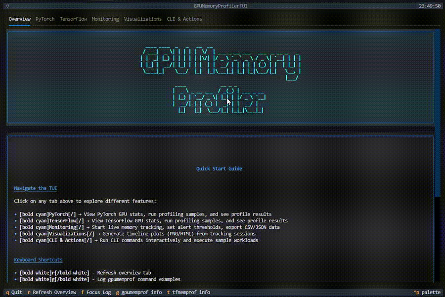
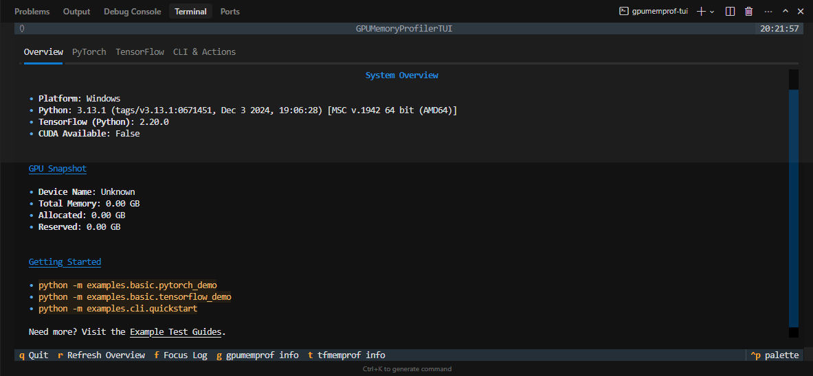
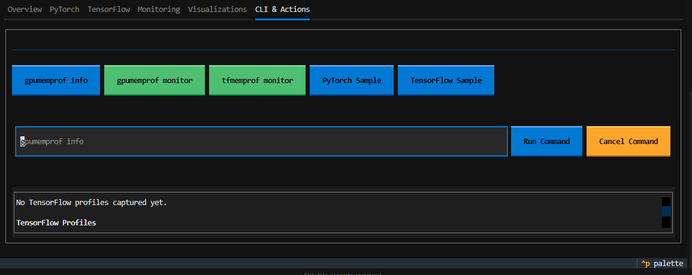

# GPU Memory Profiler

[](https://github.com/nanaagyei/gpu-memory-profiler/actions)
[](https://pypi.org/project/gpu-memory-profiler/)
[](LICENSE)
[](https://www.python.org/downloads/)
[](https://pytorch.org/)
[](https://tensorflow.org/)
[](CONTRIBUTING.md)
[](docs/tui.md)
[](docs/tui.md#prompt-toolkit-roadmap)

<p align="center">
  
  <br/>
  <em>Interactive Textual dashboard with live monitoring, visualizations, and CLI automation.</em>
</p>

A production-ready, open source tool for real-time GPU memory profiling, leak detection, and optimization in PyTorch and TensorFlow deep learning workflows.

## Why use GPU Memory Profiler?

-   **Prevent Out-of-Memory Crashes**: Catch memory leaks and inefficiencies before they crash your training.
-   **Optimize Model Performance**: Get actionable insights and recommendations for memory usage.
-   **Works with PyTorch & TensorFlow**: Unified interface for both major frameworks.
-   **Beautiful Visualizations**: Timeline plots, heatmaps, and interactive dashboards.
-   **CLI & API**: Use from Python or the command line.

## Features

-   Real-time GPU memory monitoring
-   Memory leak detection & alerts
-   Interactive and static visualizations
-   Context-aware profiling (decorators, context managers)
-   CLI tools for automation
-   Data export (CSV, JSON)
-   CPU compatibility mode

## Installation

### From PyPI (when released)

```bash
# Basic installation
pip install gpu-memory-profiler

# With visualization support
pip install gpu-memory-profiler[viz]

# With optional dependencies
pip install gpu-memory-profiler[dev]    # Development tools
pip install gpu-memory-profiler[test]   # Testing dependencies
pip install gpu-memory-profiler[docs]   # Documentation tools
```

### From Source

```bash
git clone https://github.com/nanaagyei/gpu-memory-profiler.git
cd gpu-memory-profiler

# Install in development mode
pip install -e .

# Install with visualization support
pip install -e .[viz]

# Install with development dependencies
pip install -e .[dev]

# Install with testing dependencies
pip install -e .[test]
```

### Development Setup

```bash
# Clone and setup development environment
git clone https://github.com/nanaagyei/gpu-memory-profiler.git
cd gpu-memory-profiler
python3 -m venv venv
source venv/bin/activate  # On Windows: venv\Scripts\activate
pip install -e .[dev,test]
pre-commit install
```

**Note**: Black formatting check is temporarily disabled in CI. Code formatting will be addressed in a separate PR.

## Quick Start

### PyTorch Example

```python
from gpumemprof import GPUMemoryProfiler
profiler = GPUMemoryProfiler()
@profiler.profile_function
def train_step(model, data, target):
    output = model(data)
    loss = ...
    loss.backward()
    return loss
results = profiler.get_results()
print(f"Peak memory: {results.peak_memory_mb:.2f} MB")
```

### TensorFlow Example

```python
from tfmemprof import TensorFlowProfiler
profiler = TensorFlowProfiler()
with profiler.profile_context("training"):
    model.fit(x_train, y_train, epochs=5)
results = profiler.get_results()
print(f"Peak memory: {results.peak_memory_mb:.2f} MB")
```

## Documentation

-   **[Full Documentation & Guides](docs/index.md)**
-   [CLI Usage](docs/cli.md)
-   [CPU Compatibility](docs/cpu_compatibility.md)
-   [GPU Setup (drivers + frameworks)](docs/gpu_setup.md)
-   [Testing Guides](docs/pytorch_testing_guide.md), [TensorFlow](docs/tensorflow_testing_guide.md)
-   [Example Test Guides (Markdown)](docs/examples/test_guides/README.md)
-   [Terminal UI (Textual)](docs/tui.md)
-   [In-depth Article](docs/article.md)
-   [Example scripts](examples/basic)

## Terminal UI

Prefer an interactive dashboard? Install the optional TUI dependencies and
launch the Textual interface:

```bash
pip install "gpu-memory-profiler[tui]"
gpu-profiler
```

The TUI surfaces system info, PyTorch/TensorFlow quick actions, and CLI tips.
Future prompt_toolkit enhancements will add a command palette for advanced
workflows—see [docs/tui.md](docs/tui.md) for details.

<p align="center">
  
  <br/>
  <em>Overview, PyTorch, and TensorFlow tabs inside the Textual dashboard.</em>
</p>

<p align="center">
  
  <br/>
  <em>CLI & Actions tab with quick commands, loaders, and log output.</em>
</p>

Need charts without leaving the terminal? The new **Visualizations** tab renders
an ASCII timeline from the live tracker and can export the same data to PNG
(Matplotlib) or HTML (Plotly) under `./visualizations` for deeper inspection.
Just start tracking, refresh the tab, and hit the export buttons.

The PyTorch and TensorFlow tabs now surface recent decorator/context profiling
results as live tables—with refresh/clear controls—so you can review peak
memory, deltas, and durations gathered via `gpumemprof.context_profiler` or
`tfmemprof.context_profiler` without leaving the dashboard.

When the monitoring session is running you can also dump every tracked event to
`./exports/tracker_events_<timestamp>.{csv,json}` directly from the Monitoring
tab, making it easy to feed the same data into pandas, spreadsheets, or external
dashboards.

Need tighter leak warnings? Adjust the warning/critical sliders in the same tab
to update GPU `MemoryTracker` thresholds on the fly, and use the inline alert
history to review exactly when spikes occurred.

Need to run automation without opening another terminal? Use the CLI tab’s
command input (or the quick action buttons) to execute `gpumemprof` /
`tfmemprof` commands in-place; stdout/stderr stream straight into the log and
you can cancel long-running jobs with a single click.

## CPU Compatibility

Working on a laptop or CI agent without CUDA? The CLI, Python API, and TUI now
fall back to a psutil-powered `CPUMemoryProfiler`/`CPUMemoryTracker`. Run the
same `gpumemprof monitor` / `gpumemprof track` commands and you’ll see RSS data
instead of GPU VRAM, exportable to CSV/JSON and viewable inside the monitoring
tab. PyTorch sample workloads automatically switch to CPU tensors when CUDA
isn’t present, so every workflow stays accessible regardless of hardware.

## Contributing

We welcome contributions! See [CONTRIBUTING.md](CONTRIBUTING.md) and [CODE_OF_CONDUCT.md](CODE_OF_CONDUCT.md).

## License

[MIT License](LICENSE)

---

**Version:** 0.1.0

```

```
